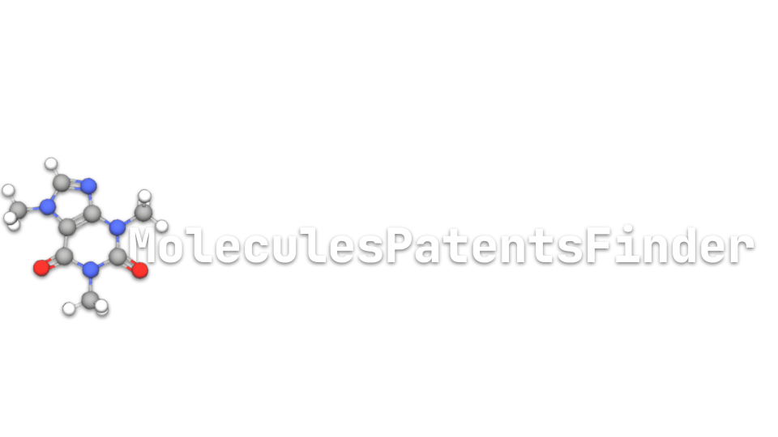

# better-moles-patent-finder
A tool designed to enhance patent discovery by leveraging MongoDB for efficient storage, querying, and analysis of patent data. This repository includes features to streamline patent searches, improve retrieval accuracy, and support advanced filtering and indexing capabilities.

<figure>
  
</figure>

## <REPONAME>: description

 

 
  
 

## Authors:
   - Fabio Bove | fabio.bove.dr@gmail.com  

## What is it?

## Project Structure

## Usage

